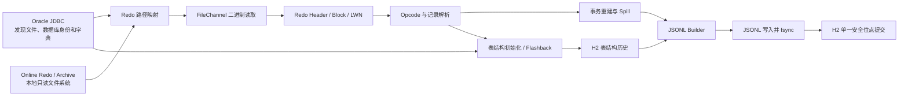

# RedoReplicator 0.1.0 实施计划

## 1. 文档目标

本文档定义将 OpenLogReplicator 翻译为纯 Java RedoReplicator 的完整实施边界、架构、恢复语义、开发阶段、测试矩阵和发布标准。实施过程中不得自行扩大范围或改变本文档已经确定的行为。

“完整实施”表示本文档中的产品和技术决策均已闭环，可以据此开发而无须补充关键需求。最终解析正确性必须由自动化测试证明，不能仅以代码翻译完成或构建成功代替。

## 2. 项目目标与源码基线

- 目标仓库：`/Users/pika/codex-cli-worker/RedoReplicator`。
- 参考仓库：`/Users/pika/codex-cli-worker/OpenLogReplicator`。
- OpenLogReplicator 基线提交：`6bc92bc1b89255fbc491e3080cb12a4c1dd8e832`。
- 基线版本：OpenLogReplicator 2.0 开发线。
- 开发版本：`0.1.0-SNAPSHOT`。
- 首个完整发行版本：`0.1.0`。
- 未经后续明确批准，不发布 `1.0.0`。
- 项目许可证：`AGPL-3.0-or-later`。
- Java 版本：JDK 17。

实施开始时必须将仓库当前的 Apache-2.0 `LICENSE` 替换为 AGPL-3.0-or-later，并补充上游及第三方声明。实施时必须建立 C++ 源文件到 Java 类的迁移清单。所有直接翻译的 Java 文件保留上游版权信息，并注明对应的 C++ 来源文件。迁移清单内的非排除项全部完成并通过测试后，才能发布 `0.1.0`。

## 3. 范围

### 3.1 包含范围

- Oracle online redo 和 archived redo 自动发现及读取。
- 使用 JDK 17 直接解析 redo 二进制内容。
- Oracle 19c 和 Oracle 26ai Free。
- 单实例非 CDB，以及单实例 CDB/PDB。
- 一个进程捕获同一 CDB 下的多个 PDB。
- INSERT、UPDATE、DELETE、DDL。
- commit、完整 rollback、rollback to savepoint。
- 交错事务重建和按提交顺序输出。
- 分区表、隐藏列、row migration/chaining、rowdependencies。
- BASICFILE CLOB/BLOB 和以 CLOB 存储的 XMLType。
- 上游非实验字符集和 Oracle 类型解析。
- H2 状态、表结构历史、崩溃恢复和 SCN 回退。
- 固定 JSONL 文件输出。
- Linux ARM64、Linux x86_64 完整发行包。

### 3.2 不包含范围

- LogMiner、XStream、GoldenGate。
- JNI、OCI、`Unsafe`、C/C++ 动态库。
- 离线手工指定 redo 文件的 Batch 模式。
- RAC、ASM、Data Guard 和远程 redo 文件系统。
- Kafka、网络流、ZeroMQ、Protobuf、Debezium、Prometheus。
- TDE 加密表空间。
- Heap compression、HCC 和 NOLOGGING 变更。
- 临时表、嵌套表、Oracle 内部表、系统表、物化视图日志表。
- 二进制 XMLType。
- 初始全量数据同步。
- HTTP 管理接口。

## 4. 总体架构



JDBC 只负责数据库身份、日志位置、归档状态、容器信息和数据字典查询。Redo 字节只能由程序通过本地文件系统读取，因此 RedoReplicator 必须部署在 Oracle 所在主机或共享相同数据卷的 Sidecar 容器中，并获得 redo、oradata 和 FRA 的只读权限。

二进制解析统一使用 `FileChannel` 和 `ByteBuffer`，显式处理字节序和无符号数。支持：

- Redo block size：512、1024、4096 字节。
- 数据库 block size：2K、4K、8K、16K、32K。
- 自动检测 redo 格式和字节序。
- 未知格式、无法验证的 header 或不支持的版本立即停止，不进行猜测性解析。

## 5. Java 工程结构

项目使用 Maven 单模块，不引入 Spring 或大型运行框架。

| OpenLogReplicator 模块 | Java 包 | 职责 |
|---|---|---|
| `common/types`、`RedoLogRecord` | `redo.common` | SCN、XID、RowID、sequence、offset 和定长二进制类型 |
| `reader` | `redo.reader` | 文件打开、block/LWN 读取、online/archive 切换 |
| `parser/OpCode*` | `redo.parser` | redo record 和全部非实验 opcode 解码 |
| `parser/Transaction*` | `redo.transaction` | 事务交错、提交、回滚和 spill |
| `metadata/Schema*`、`SystemTransaction` | `redo.schema` | 数据字典、DDL、对象版本和结构历史 |
| `locales` | `redo.charset` | Oracle 字符集映射 |
| `Builder`、`BuilderJson` | `redo.output` | 类型转换和固定 JSON 格式 |
| `WriterFile` | `redo.output` | JSONL 写入、滚动、fsync 和磁盘错误处理 |
| `ReplicatorOnline`、`Database*` | `redo.source` | JDBC 自动发现、路径映射和启动预检 |
| `State`、`Checkpoint` | `redo.state` | H2 安全位点、结构历史和迁移 |
| `main`、`OpenLogReplicator` | `redo.cli` | CLI、配置、生命周期和脚本入口 |

不翻译上游 Kafka、Stream、ZeroMQ、Protobuf、Prometheus、Batch Reader 和二进制 XMLType 实验代码。

## 6. Oracle 支持规则

### 6.1 数据库与对象命名

- CDB 模式配置名称：`PDB.OWNER.TABLE`。
- 非 CDB 模式配置名称：`OWNER.TABLE`。
- 一个实例使用一个安装目录、一个 YAML、一个 H2 和一个进程。
- 多个数据库实例必须使用相互独立的安装目录和进程。

### 6.2 启动预检

程序启动时必须检查：

- 数据库版本为 19c 或 26ai Free。
- 数据库处于 `ARCHIVELOG` 模式。
- 已启用 minimal supplemental logging。
- 已启用 `FORCE LOGGING`。
- 所选表和列不属于不支持范围。
- 所需 JDBC 视图和字典查询权限完整。
- 所有当前 redo/archive 路径都能通过 `redoPathMappings` 映射。
- 映射后的文件存在且只读可访问。
- DBID、incarnation 和 RESETLOGS identity 与 H2 一致。

任何硬检查失败都直接退出，并输出用户可执行的修复提示。程序不得使用 SYSDBA，不得创建用户、授权、开启归档或修改 supplemental logging。

发行包中的 `sql/` 目录提供最小权限、数据库设置和验证 SQL，由用户手动执行，再将普通捕获账号的用户名和密码写入 YAML。

## 7. 配置契约

默认配置文件为 `conf/redo-replicator.yaml`：

```yaml
database:
  url: jdbc:oracle:thin:@//oracle:1521/FREE
  username: C##REDO_REPLICATOR
  password: change-me
  redoPathMappings:
    - oracle: /opt/oracle/oradata
      local: /oracle/oradata
    - oracle: /opt/oracle/fast_recovery_area
      local: /oracle/fra

capture:
  startScn:
  includeTables:
    - FREEPDB1.APP.ORDERS
    - FREEPDB1.APP.CUSTOMERS_.*
  excludeTables: []

output:
  directory: output
  maxFileSizeMb: 256
  checkpointHeartbeat: true

state:
  directory: data
  transactionMemoryMb: 1024

archive:
  pollIntervalSeconds: 10
  missingFileTimeoutSeconds: 300

logging:
  level: INFO
```

配置行为固定如下：

- YAML 只在启动时读取，修改后必须重启。
- `includeTables` 必填，支持精确名称和 Java 正则表达式。
- `excludeTables` 可选，并且优先于 include。
- `redoPathMappings` 使用最长 Oracle 路径前缀匹配。
- 密码允许明文保存，但绝不写入日志。
- YAML 权限不是 `600` 时记录安全警告。
- 未知字段、拼写错误、无效正则、重复映射、目录逃逸安装根目录均视为配置错误。
- 相对目录必须解析在安装根目录内部。
- 配置中尚未创建的表进入等待状态；后续 CREATE 匹配时从 DDL commit 起捕获。
- 重启时新增 include 表从当时 current SCN 开始，不做历史回填。
- 重启时移除的表从新进程开始停止捕获。

## 8. 起始位点与自动文件发现

### 8.1 起始 SCN

- 第一次启动且 `startScn` 有值：从指定 SCN 开始。
- 第一次启动且 `startScn` 为空：使用启动时数据库 current SCN。
- H2 已存在：始终从 H2 安全位点恢复，YAML 中的 `startScn` 不得覆盖它。
- 调整到更早 SCN 必须执行 `rewind.sh --scn <SCN>`。
- rewind 目标必须小于或等于当前安全 SCN，禁止向前跳 SCN。

### 8.2 自动发现顺序

1. JDBC 查询数据库身份、online redo、archived redo、container 和 current SCN。
2. 找到覆盖起始 SCN 的 archive。
3. 按 redo thread 和 sequence 连续消费 archive。
4. 追平归档后自动切换到 online redo。
5. log switch 后继续等待并消费下一 sequence。

下一归档不存在时，每 `pollIntervalSeconds` 秒重新查询一次，最多等待 `missingFileTimeoutSeconds`。发生 sequence gap，或 online redo 已覆盖但所需 archive 不存在时，程序停止并保留安全位点，绝不跳过缺口。

## 9. H2 状态与表结构历史

不生成多份 Checkpoint 文件。H2 是唯一恢复数据库，至少包含以下表。

### 9.1 `schema_migration`

- `version`
- `description`
- `checksum`
- `applied_at`

迁移使用项目内置、按版本排序的 SQL。只允许自动向前迁移。迁移前自动备份 H2；失败时保留原库并停止。禁止自动降级。

### 9.2 `runtime_state`

固定只有 `id=1` 一行，每次覆盖更新：

- DBID、incarnation、RESETLOGS identity。
- durable SCN、redo thread、sequence、offset。
- 最早未提交事务的 low-watermark SCN、thread、sequence、offset。
- 当前 JSONL 文件编号和已 fsync 字节偏移。
- 当前配置指纹。
- 更新时间。

### 9.3 `table_schema_history`

- container、owner、table。
- object ID、data object ID。
- 生效 SCN。
- 完整表结构 JSON。
- 触发变更的 DDL 类型和 DDL 文本。
- 结构来源：initial、flashback、redo。
- drop tombstone。

首次捕获保存选中表的完整结构。普通 DML 不重复保存结构；只有已提交的 DDL 保存 DDL 和变更后的完整结构。结构历史不自动清理。

目标 SCN 的结构恢复顺序固定为：

1. H2 中目标 SCN 之前最近的结构。
2. Oracle Flashback 数据字典。
3. 从现存最早 archive 开始正向重放字典 redo。
4. 仍不能证明结构完整时停止，不输出 schemaless 或推测数据。

H2 被删除或损坏时按相同规则自动重建；结构完整性得到证明以前禁止输出 DML。

## 10. 事务、持久化与恢复语义

输出保证为 at-least-once：允许故障恢复后重复完整事务，不允许遗漏已提交事务。

每个完整 LWN 的处理顺序固定为：

1. 完整读取并解析 LWN。
2. 更新事务状态和表结构状态。
3. 将其中已提交事务写入 JSONL。
4. 对 JSONL 执行 `FileChannel.force(true)`。
5. 在一个 H2 事务中更新结构历史和 `runtime_state`。
6. 提交 H2 事务。

故障行为：

- JSONL 已 fsync、H2 未提交：重启后允许重复对应完整输出。
- JSONL 尾部只有半条消息：启动时截断到 H2 的安全字节偏移。
- JSONL 实际长度小于 H2 安全偏移：状态不一致，停止启动。
- 长事务跨越多个 LWN：从 low-watermark 重新读取，不能只从 durable offset 读取。
- `data/tmp/` 只保存未提交事务 spill；崩溃后清空并从 low-watermark 重放。
- 事务 commit 或 rollback 后删除对应 spill。

默认 JVM 最大堆为 2 GB，事务内存阈值为 1024 MB。必须至少支持单事务 100,000 行或 512 MB。

## 11. 表、操作和数据类型

必须支持：

- INSERT，包括多行 INSERT。
- UPDATE。
- DELETE，包括多行 DELETE。
- 完整 rollback 和 rollback to savepoint。
- 交错事务和按提交顺序输出。
- null/not null、默认值、隐藏列。
- 分区表、rowdependencies、row migration/chaining。
- 运行期 CREATE、ALTER、DROP、TRUNCATE 和相关字典变更。
- BASICFILE CLOB、BLOB。
- 以 CLOB 存储的 XMLType。

支持的 Oracle 内部类型：

- 1：VARCHAR2、NVARCHAR2，包括以 LOB 形式存储的值。
- 2：NUMBER、FLOAT。
- 12：DATE。
- 23：RAW。
- 58：CLOB 存储的 XMLType。
- 96：CHAR、NCHAR。
- 100：BINARY_FLOAT。
- 101：BINARY_DOUBLE。
- 112：CLOB。
- 113：BLOB。
- 180：TIMESTAMP。
- 181：TIMESTAMP WITH TIME ZONE。
- 182：INTERVAL YEAR TO MONTH。
- 183：INTERVAL DAY TO SECOND。
- 208：UROWID、ROWID。
- 231：TIMESTAMP WITH LOCAL TIME ZONE。
- 252：BOOLEAN。

不支持的列类型固定输出字符串 `"?"`，不得静默丢列。

翻译上游全部字符集映射。Oracle 端到端测试至少覆盖 AL32UTF8、ZHS16GBK、WE8MSWIN1252；其他字符集使用字节级 fixture 和与 C++ 基线的对比测试。

## 12. JSONL 输出契约

- 只输出 OpenLogReplicator 原生 JSON，不提供其他格式。
- 固定采用上游 `message=0` 的消息拆分语义：begin、每条 DML、commit 分别为独立 JSONL 行。
- 可按配置输出 `chkpt` heartbeat；关闭 heartbeat 不影响 H2 状态推进。
- SCN 使用十进制数字。
- XID 使用经典十六进制格式。
- `db` 始终输出，值为 PDB 名或非 CDB 数据库名。
- DDL 只输出选中表和对象相关的变更。
- 与 C++ 基线比较时，JSON 对象 key 顺序和空白可以不同，层级、字段名、类型和值必须一致。
- 输出文件名为 `output/redo-000001.jsonl`，编号单调递增。
- 默认达到 256 MB 后滚动，只能在完整 JSON 消息之间滚动。
- 单条超大 LOB 消息可以超过 256 MB。
- 历史 JSONL 永不自动删除。
- 磁盘满、写入失败或 fsync 失败立即停止。
- rewind 后保留旧输出并创建新的递增文件，不写入自定义 rewind 消息。

消费者只有读到完整 begin、DML、commit 序列后才能应用事务；文件尾部没有 commit 的事务必须丢弃，等待重放。

## 13. CLI、脚本与运行行为

发行包提供：

```text
bin/run.sh
bin/start.sh
bin/stop.sh
bin/restart.sh
bin/status.sh
bin/validate.sh
bin/rewind.sh --scn <SCN>
bin/backup.sh
bin/restore.sh <backup-file>
```

- `run.sh`：前台运行。
- `start.sh`：后台运行，使用 PID 文件阻止重复启动。
- `stop.sh`：发送 SIGTERM，默认等待 60 秒；超时返回失败，不自动 `kill -9`。
- `restart.sh`：安全停止后启动。
- `validate.sh`：检查 YAML、JDBC 权限、数据库状态、对象范围和 redo 文件权限，不开始复制。
- `rewind.sh`：要求进程已停止，验证 redo 和结构可重建后覆盖单行安全位点。
- `backup.sh`：要求进程已停止，备份 H2、YAML 和状态，不包含 JSONL 和 `data/tmp/`。
- `restore.sh`：要求进程已停止，校验 DBID、incarnation 和 RESETLOGS identity 后恢复。

SIGTERM 到达时，程序完成当前 LWN、fsync JSONL、提交 H2 后退出。

运行进程在每个 LWN 后原子更新非权威 `data/status.json`。`status.sh` 根据 PID 和该文件显示进程状态、当前 redo 文件、安全 SCN 和 lag。`status.json` 不参与恢复，可安全删除。

日志按 100 MB 滚动，保留 10 个 gzip 压缩历史文件。错误日志必须包含文件、sequence、offset、SCN 和处理阶段，但不能包含密码。

## 14. 依赖、构建与许可证

初始固定依赖版本：

| 依赖 | 版本 | 用途 |
|---|---:|---|
| H2 | `2.4.240` | 状态和结构历史 |
| Oracle JDBC `ojdbc17` | `23.26.3.0.0` | Oracle 元数据和字典查询 |
| Jackson BOM | `2.22.1` | YAML 和 JSON |
| Picocli | `4.7.7` | CLI |
| SLF4J | `2.0.18` | 日志 API |
| Logback | `1.6.2` | 日志实现 |
| JUnit 5 BOM | `5.14.4` | 测试 |

Oracle JDBC 以未修改 Jar 形式随运行包发布，并附带 Oracle Free Use Terms and Conditions。不得移除 Oracle 声明，不得修改 Jar，也不得为 JDBC 单独收费。

H2 选择 MPL-2.0；Picocli、Jackson 选择 Apache-2.0；SLF4J 选择 MIT；Logback 选择 LGPL-2.1。所有许可证全文和依赖声明放入 `THIRD-PARTY-LICENSES/`，同时生成 CycloneDX `SBOM.json`。

本地开发显式使用：

```text
/Library/Java/JavaVirtualMachines/jdk-17.jdk/Contents/Home
```

Linux runtime 在 Debian Docker 中使用 Debian OpenJDK 17，分 ARM64 和 x86_64 执行 `jdeps` 和 `jlink`。不得使用 Eclipse Temurin。所有构建镜像和系统包版本在发行构建时固定并写入 SBOM。

## 15. 实施阶段与硬门禁

### 阶段 1：测试基建和迁移清单

交付物：

- C++ 文件到 Java 类的迁移清单。
- OpenLogReplicator 基线构建脚本。
- redo 二进制 fixture 格式。
- C++/Java 中间解析结果比较器。
- C++/Java JSON 结构比较器。
- 许可证、NOTICE 和来源标记规则。

硬门禁：测试可以在固定输入上复现 C++ 输出；迁移清单覆盖全部非实验范围。

### 阶段 2：Redo 基础解析

交付物：

- redo header、block、LWN、record header。
- block size 和字节序检测。
- 全部目标 opcode 的 Java 类和分派框架。
- sequence、offset、SCN、XID 和 RowID 基础类型。

硬门禁：每类 fixture 的 block、LWN、record 边界及关键字段与 C++ 中间结果一致。

### 阶段 3：字典和 H2

交付物：

- 初始字典加载。
- system transaction 和 DDL 字典变更。
- H2 表结构、版本化迁移和备份。
- H2、Flashback、redo 三段式结构重建。
- DBID/incarnation/RESETLOGS 校验。

硬门禁：对任意覆盖测试历史的目标 SCN，能够得到唯一且完整的表结构；证据不足时正确停止。

### 阶段 4：事务重建

交付物：

- interleaved transaction。
- commit、rollback、savepoint partial rollback。
- low-watermark。
- 事务内存限制和 `data/tmp/` spill。

硬门禁：交错、长事务和故障恢复测试中不遗漏已提交事务；rollback 数据不输出。

### 阶段 5：类型和复杂表

交付物：

- 全部目标 Oracle 类型。
- 字符集转换。
- LOB、CLOB XMLType。
- 分区、隐藏列、row migration/chaining。
- DDL 及运行期结构切换。

硬门禁：每个类型和复杂表场景都有 fixture 与 Oracle 端到端测试，并与 C++ 基线相等。

### 阶段 6：输出、状态和 CLI

交付物：

- 固定 JSONL Builder。
- 文件滚动、fsync、H2 安全提交。
- 尾部截断、恢复、rewind。
- YAML 校验、日志、运行脚本、备份和恢复。

硬门禁：全部故障注入通过；脚本在新的解压目录中无需构建工具即可运行。

### 阶段 7：Oracle 矩阵、性能和发行

交付物：

- 四组 Oracle Compose 环境。
- 完整正确性和故障矩阵。
- 原生架构性能测试。
- ARM64/x86_64 jlink 运行包。
- 源码包、SHA256、SBOM 和 GitHub Release。

硬门禁：第 18 节的完成定义全部满足。

任何阶段只有在本阶段迁移清单归零、自动化对比通过且没有未解释差异时，才能进入下一阶段。

## 16. Oracle Docker 测试矩阵

Oracle 环境固定放置在：

```text
/Users/pika/docker_opt/localdb/oracle/19c_arm64
/Users/pika/docker_opt/localdb/oracle/19c_x86_64
/Users/pika/docker_opt/localdb/oracle/26ai_arm64
/Users/pika/docker_opt/localdb/oracle/26ai_x86_64
```

2026-08-13 已验证的镜像固定值：

| 环境 | 镜像 |
|---|---|
| 19c ARM64 | `container-registry.oracle.com/database/enterprise:19.19.0.0@sha256:3843234f6fd1ed084b1dd7ad42eeeaa95ad13f12c790810cb368bb58f8ad42ba` |
| 19c x86_64 | `container-registry.oracle.com/database/enterprise:19.3.0.0@sha256:2df7530ac81566f8659e13d41fda029e5c08a983147e5b372b173476a74ab62e` |
| 26ai Free 双架构索引 | `container-registry.oracle.com/database/free:23.26.1.0@sha256:f7e6cdba3d492bf8fe654303cf92e6c9adc4586e2b4527d7c3200bf96fb21f1b` |
| 26ai Free x86_64 manifest | `sha256:51940ce2a4c9a085c9deb715713d68c579756e9bf09a0d7318c7e3e28f70ba1e` |
| 26ai Free ARM64 manifest | `sha256:3373059fb47edc0053c297af756f4f0fbbb46179b5eec20f81713fd73a356ee2` |

19c x86_64 在当前 ARM Mac 上使用 Docker 模拟执行。正确性必须测试四组组合；性能测试只在本机原生架构执行。

Compose 使用 Oracle 和 RedoReplicator Sidecar。Oracle 对数据目录拥有读写权限；RedoReplicator 对 redo、oradata、FRA 只读挂载。测试开始后必须通过 SQL 记录实际数据库 banner、版本、架构、DBID 和字符集，不能只相信镜像标签。

测试完成后删除对应容器、网络、volume 和 Oracle 数据文件，仅保留：

- `docker-compose.yml`
- 初始化和测试 SQL
- 复测 README

测试源码、SQL、比较器、故障脚本和 Compose 模板提交到项目；镜像、数据库文件、日志、JSONL 和性能结果不得提交。

## 17. 测试与验收

### 17.1 正确性矩阵

- Oracle 19c ARM64、19c x86_64、26ai Free ARM64、26ai Free x86_64 全部通过。
- Java JSON 与 C++ 基线结构相等。
- DML、DDL、LOB、字符集、分区、回滚、长事务、PDB 和 rewind 全部覆盖。
- 正常运行不产生重复；故障恢复允许完整事务重复，但不得缺失任何已提交事务。
- 不支持场景必须明确失败，不能静默跳过。

测试数据中的每个事务和变更都带唯一业务标识。比较器同时校验事务提交顺序、操作类型、表、主键、before/after 值和完整事务边界。

### 17.2 强制故障注入

- 解析过程中 `kill -9`。
- JSON 写入中断。
- 磁盘满。
- H2 写入失败。
- 临时 archive gap。
- 永久 archive gap。
- online redo 被覆盖且 archive 缺失。
- transaction spill 中断。
- DDL 后 rewind。
- H2 删除和损坏。
- JSONL 半条消息和尾部损坏。
- SIGTERM 正常停止超时。

每个故障都必须断言：无已提交数据丢失、允许可解释重复、无静默跳 sequence、H2 和 JSONL 的恢复位置一致。

### 17.3 性能基准

- AL32UTF8。
- 10 张普通表。
- 平均每行 1 KB。
- INSERT/UPDATE/DELETE 比例 60/30/10。
- 每 100 行提交一次。
- 不包含 LOB 和 DDL。
- 本机原生架构、本地 SSD、2 GB heap。
- 持续运行 30 分钟。

验收目标：

- 吞吐不低于 5,000 changed rows/s。
- commit 到 JSONL fsync 的 P95 不高于 5 秒。
- 运行期间无数据丢失和不可解释错误。

LOB、DDL、超大事务只做独立正确性和稳定性测试。Oracle 商业镜像的性能结果仅保存在本地，不公开发布。

## 18. 打包、升级和完成定义

发行目录：

```text
redo-replicator/
  bin/
  conf/redo-replicator.yaml
  runtime/
  lib/
  output/
  data/
  logs/
  sql/
  LICENSE
  README.md
  README_EN.md
  THIRD-PARTY-LICENSES/
```

发布产物：

```text
redo-replicator-0.1.0-linux-arm64.tar.gz
redo-replicator-0.1.0-linux-x86_64.tar.gz
redo-replicator-0.1.0-sources.tar.gz
SHA256SUMS
SBOM.json
```

运行包包含 jlink OpenJDK 17 runtime，用户无须预装 Java。用户解压后只需修改 YAML、执行文档中的 Oracle SQL，然后运行 `bin/start.sh`。

0.x 升级流程固定为：

1. 解压新版本到新目录，不覆盖旧目录。
2. 停止旧进程。
3. 使用旧版本 `backup.sh` 备份。
4. 使用新版本 `restore.sh` 恢复。
5. 新版本自动执行 H2 向前迁移。
6. 执行 `validate.sh` 后启动。

完整完成必须同时满足：

- C++ 到 Java 迁移清单中的目标项全部完成。
- 所有阶段硬门禁通过。
- 四组 Oracle 正确性矩阵通过。
- 全部故障注入通过。
- 性能目标通过。
- AGPL 和第三方许可证检查通过。
- ARM64、x86_64、sources、SHA256 和 SBOM 产物齐全。
- 两个 Linux 运行包均在干净容器中完成“解压、改配置、启动”测试。
- 中文 README、英文 README、Oracle 手工 SQL 和故障排查文档完整。
- 创建 `0.1.0` GitHub Release 并上传全部发行产物。
- 所有项目变更均已提交并推送到远程仓库。

在上述条件全部满足以前，不得宣称 `0.1.0` 已完成。

## 19. 官方依赖与许可证参考

- [Oracle JDBC Maven Central Guide](https://www.oracle.com/database/technologies/maven-central-guide.html)
- [Oracle Free Use Terms and Conditions](https://www.oracle.com/downloads/licenses/oracle-free-license.html)
- [OpenJDK Legal Documents](https://openjdk.org/legal/)
- [H2 Database](https://github.com/h2database/h2database)
- [Jackson](https://github.com/FasterXML/jackson)
- [Picocli](https://github.com/remkop/picocli)
- [SLF4J License](https://www.slf4j.org/license.html)
- [Logback License](https://logback.qos.ch/license.html)
